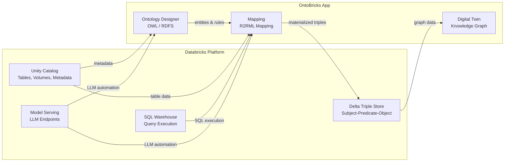
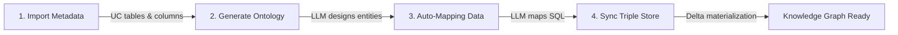

# Product & go-to-market

## OntoBricks -- Value Proposition Deck

> Slide-ready content for presenting OntoBricks to enterprise stakeholders.
> Each section maps to one slide or slide group.

### Agenda

- The data semantics Gap
- Where OntoBricks fits
- The 4-Click pipeline
- Key features and capabilities
- Competitive landscape
- Value Proposition
- Conclusion & next steps

---

### Slide 1: The Data Semantics Gap

#### Every enterprise has the data. Almost none have the meaning.

Organizations invest heavily in Lakehouse platforms to store and process data at scale. But structured data alone does not capture what the data *means* -- the entities it represents, how they relate, and what business rules apply.

**The five gaps:**


| Gap                         | What happens today                                                                                                                                                          |
| --------------------------- | --------------------------------------------------------------------------------------------------------------------------------------------------------------------------- |
| **No semantic layer**       | Tables have columns and types, but nothing that says "a Customer *has* Contracts, which *contain* Invoices." The business meaning lives outside the data.                   |
| **Siloed knowledge**        | Domain expertise is trapped in documentation, ER diagrams, or the heads of senior engineers -- disconnected from the data itself.                                           |
| **Query-only exploration**  | Understanding relationships requires ad-hoc SQL joins. There is no visual, graph-based way to navigate across tables.                                                       |
| **Inaccessible standards**  | Industry ontologies (FIBO for finance, CDISC for clinical, IOF for manufacturing) exist but require specialized desktop tools that do not integrate with the data platform. |
| **No schema-to-graph path** | Building a knowledge graph from Lakehouse tables today requires stitching together multiple external tools, custom ETL, and manual RDF generation.                          |


**The result:** data is stored but not understood, relationships are implicit but not navigable, and knowledge graph adoption stalls because the infrastructure barrier is too high.

---

### Slide 2: Where OntoBricks Fits

#### A Knowledge Graph Builder that lives inside Databricks.

OntoBricks is not a separate platform. It deploys as a **Databricks App** and uses the services you already have.




**Key architecture points:**


| Resource       | Role                                                                       |
| -------------- | -------------------------------------------------------------------------- |
| Unity Catalog  | Storage for tables, domain files (Volumes), and metadata                  |
| SQL Warehouse  | Executes all data queries -- no separate compute                           |
| Model Serving  | Powers LLM-driven ontology generation and auto-mapping                  |
| Delta Table    | Triple store -- triples live in your Lakehouse, not in a separate graph DB |
| Databricks App | Deployment target -- `databricks apps deploy` and you are live             |
| MCP Server     | Exposes knowledge-graph tools to the Databricks Playground and LLM clients |


**Standards bridge:** OntoBricks uses W3C semantic web standards internally (OWL, R2RML, SPARQL) but translates everything to Spark SQL for execution. Users never need to learn RDF.

---

### Slide 3: The 4-Click Pipeline

#### From raw tables to a queryable knowledge graph in minutes, not months.

After a one-time setup (Databricks connection, LLM endpoint, triple store table), the entire pipeline is four actions:




| Step  | Where in OntoBricks      | What happens                                                                        | Powered by        |
| ----- | ------------------------ | ----------------------------------------------------------------------------------- | ----------------- |
| **1** | Domain > Metadata       | Fetches table and column metadata from Unity Catalog                                | Unity Catalog API |
| **2** | Ontology > Generate      | LLM designs entities, relationships, attributes, and inheritance from your metadata | Model Serving     |
| **3** | Mapping > Auto-Map | LLM generates SQL queries and column mappings for every entity and relationship     | Model Serving     |
| **4** | Digital Twin > Build     | Executes all mappings and populates the triple store table                          | SQL Warehouse     |


**Traditional approach:** weeks of manual ontology design, custom ETL pipelines, separate graph database setup.

**OntoBricks approach:** minutes of guided, LLM-automated interaction -- all within the Databricks platform.

---

### Slide 4: Key Features and Capabilities

#### Four pillars, one integrated experience.

#### Ontology Design


| Capability                | Description                                                                                  |
| ------------------------- | -------------------------------------------------------------------------------------------- |
| Visual Designer (OntoViz) | Drag-and-drop entities, relationships, and inheritance hierarchies on an interactive canvas  |
| LLM-Powered Wizard        | Point to Unity Catalog tables; the LLM generates a complete OWL ontology from metadata       |
| Industry Standards        | One-click import of FIBO (6 domains), CDISC (5 standards), IOF (3 domains)                   |
| OWL/RDFS Import           | Load existing ontologies from files or Unity Catalog Volumes                                 |
| Constraints and Rules     | Cardinality, value constraints, property characteristics, SWRL rules, expressions and axioms |


#### Mapping (Data Mapping)


| Capability           | Description                                                                      |
| -------------------- | -------------------------------------------------------------------------------- |
| Visual Mapping       | Click entities on the interactive graph to configure SQL sources                 |
| AI Auto-Mapping       | LLM generates SQL queries and column mappings for all entities and relationships |
| Attribute Mapping    | Column-level precision with live data preview                                    |
| Relationship Mapping | Direction control -- forward, reverse, or bidirectional                          |
| R2RML Generation     | W3C-compliant mapping generated automatically -- users never write mapping rules |


#### Digital Twin (Sync and Explore)


| Capability            | Description                                                                          |
| --------------------- | ------------------------------------------------------------------------------------ |
| One-Click Sync        | Materialize triples into a Delta table stored in Unity Catalog                       |
| Knowledge Graph       | Sigma.js WebGL graph with search, filtering, depth control, and entity detail panels |
| Quality Checks        | Async validation against ontology constraints (cardinality, orphans, value rules)    |
| Dashboard Integration | Embed Databricks dashboards with parameter mapping to ontology entities              |
| Triples Grid          | Sortable, searchable table view of all materialized triples                          |


#### Domain Management


| Capability            | Description                                               |
| --------------------- | --------------------------------------------------------- |
| Unity Catalog Storage | Save and load domains to UC Volumes with version control |
| Import/Export         | Import OWL, RDFS, R2RML; export OWL and R2RML             |
| Secret-Safe Design    | Domains never store tokens, passwords, or query results  |


#### External Access


| Capability | Description |
| --- | --- |
| REST API (Digital Twin) | Stateless endpoints for triple store status, entity search, ontology/R2RML/SQL retrieval, and build triggers |
| GraphQL API | Auto-generated typed schema per domain with configurable depth, GraphiQL playground |
| MCP Server | Model Context Protocol server for Databricks Playground and LLM clients (Cursor, Claude Desktop) |
| Ontology Assistant | Conversational agent for natural-language ontology editing (add entities, clean orphans, etc.) |


---

### Slide 5: Competitive Landscape

#### No existing solution provides an integrated, Databricks-native knowledge graph experience.


| Solution                       | What it does                                                                           | Limitation for Databricks users                                                                                          |
| ------------------------------ | -------------------------------------------------------------------------------------- | ------------------------------------------------------------------------------------------------------------------------ |
| **Palantir Foundry**           | Powerful ontology layer (Ontology + AIP) for entity modeling and operational analytics | Proprietary platform; requires Palantir infrastructure; expensive licensing; no W3C standards (OWL/RDF); lock-in         |
| **Snowflake Cortex + Horizon** | ML functions and governance catalog for the Snowflake ecosystem                        | No ontology design; no RDF/OWL; no graph visualization; Snowflake-only -- not available on Databricks                    |
| **Microsoft Fabric + Purview** | Unified analytics with a governance catalog (Purview) for lineage and classification   | Governance-focused, not ontology-focused; no knowledge graph materialization; no visual graph exploration; Azure-centric |
| **Neo4j / Amazon Neptune**     | Dedicated graph databases optimized for traversal queries                              | Separate infrastructure; data must be exported from the Lakehouse; no native Delta integration; data duplication         |
| **Stardog**                    | Knowledge graph platform with virtual graph and reasoning                              | Separate server; JDBC connector to Databricks but no native integration; commercial license                              |
| **TopBraid / Protege**         | Enterprise and desktop OWL ontology editors                                            | No Databricks integration; cannot map to tables; no SQL generation; no knowledge graph exploration                       |
| **dbt Semantic Layer**         | SQL-based semantic modeling for metrics and dimensions                                 | No ontology/OWL; no graph visualization; limited to dimensional modeling concepts                                        |


#### OntoBricks differentiator

OntoBricks is the **only** solution that combines all of the following in a single application:

- Databricks-native (deploys as an App, uses UC + SQL Warehouse)
- W3C standards-based (OWL, R2RML, SPARQL)
- LLM-automated (ontology generation + data mapping)
- Graph-visualizing (interactive knowledge graph)
- Industry-standard ready (FIBO, CDISC, IOF)
- Open-source (MIT license)

---

### Slide 6: Value Proposition

#### Quantified benefits for the enterprise.


| Benefit                     | Without OntoBricks                                                        | With OntoBricks                                                            |
| --------------------------- | ------------------------------------------------------------------------- | -------------------------------------------------------------------------- |
| **Time to knowledge graph** | Weeks to months of manual ontology design, custom ETL, and graph DB setup | Minutes -- 4-click LLM-automated pipeline                                  |
| **Infrastructure cost**     | Separate graph database (Neo4j, Neptune, Stardog) + compute + maintenance | Zero -- triples live in Delta, queries run on SQL Warehouse                |
| **Industry compliance**     | Requires Protege or TopBraid + manual import + custom integration         | One-click import of FIBO, CDISC, IOF directly from the Databricks platform |
| **Knowledge sharing**       | ER diagrams in Confluence, tribal knowledge in meetings                   | Versioned ontology domains in Unity Catalog, shareable across teams       |
| **Data quality**            | Manual spot-checks or custom validation scripts                           | Automated quality checks against formal ontology constraints               |
| **Vendor lock-in**          | Proprietary formats (Palantir, Stardog) or platform-specific (Snowflake)  | Open standards (OWL, R2RML, SPARQL) -- export and reuse anywhere           |
| **Skill barrier**           | Requires RDF/SPARQL expertise or graph DB skills                          | Visual designer + LLM automation -- domain experts contribute directly     |


#### Who benefits


| Persona              | Value                                                                 |
| -------------------- | --------------------------------------------------------------------- |
| **Data Engineers**   | Build semantic layers without leaving the Databricks platform         |
| **Domain Experts**   | Model and explore entity relationships visually, without SQL          |
| **Data Architects**  | Evaluate knowledge graph approaches with zero infrastructure overhead |
| **Compliance Teams** | Apply industry standards (FIBO, CDISC, IOF) to real data              |


---

### Slide 7: Conclusion and Next Steps

#### Deploy a knowledge graph on Databricks in minutes.

**Get started:**

```
databricks apps deploy --app-name ontobricks
```

**Requirements:**


| Resource      | Details                                                                  |
| ------------- | ------------------------------------------------------------------------ |
| SQL Warehouse | Serverless recommended; Classic also supported                           |
| Model Serving | Optional -- required for LLM features (ontology generation, auto-mapping) |
| Unity Catalog | For table access and domain storage (Volumes)                           |


**Resources:**


| Resource                 | Link                                                |
| ------------------------ | --------------------------------------------------- |
| Source Code              | GitHub repository (MIT license)                     |
| Documentation            | Full user guide, architecture docs, API reference   |
| Automated Pipeline Guide | Step-by-step: tables to knowledge graph in 4 clicks |
| Import Guide             | FIBO, CDISC, IOF import instructions                |
| MCP Server Guide         | Deployment, tools, client configuration for Playground, Cursor, Claude Desktop |


**Next steps for your organization:**

1. **Try it** -- Deploy OntoBricks on a development workspace with sample data
2. **Identify a use case** -- Pick a domain with complex entity relationships (e.g., customer-contract-invoice, clinical trial data, manufacturing processes)
3. **Run the 4-click pipeline** -- Import metadata, generate ontology, run auto-mapping, sync
4. **Explore the graph** -- Navigate entities and relationships visually; run quality checks
5. **Evaluate** -- Compare the time, cost, and insight quality against your current approach

---

*OntoBricks -- Bridging relational data and knowledge graphs on Databricks.*

---

## OntoBricks — Field Engineering Innovation Project

### Summary

OntoBricks is a **Knowledge Graph Builder for Databricks** that brings **graph database capabilities and formal reasoning** to the Lakehouse — without requiring separate graph infrastructure. It transforms relational tables stored in Unity Catalog into a structured knowledge graph by leveraging semantic web standards (OWL, R2RML, RDF), a Lakebase Postgres graph engine, OWL 2 RL reasoning, and LLM-powered automation.

Users can design ontologies visually or import industry standards (FIBO for finance, CDISC for clinical data, IOF for manufacturing), map ontology entities to Databricks tables, materialize the result into a Delta-backed triple store mirrored on Lakebase Postgres, run **formal reasoning** (OWL 2 RL deductive closure, SWRL rules, transitive/symmetric inference), and explore the knowledge graph through interactive visualization. The entire pipeline — from raw tables to a reasoned, queryable knowledge graph — can be completed in as few as four clicks thanks to LLM-driven ontology generation and automatic data mapping.

OntoBricks runs as a **Databricks App**, making it natively integrated with the Databricks platform: Unity Catalog for storage and metadata, SQL Warehouses for query execution, and Model Serving endpoints for LLM features.

---

### Problem Statement

Organizations on Databricks accumulate large volumes of structured data across catalogs and schemas, but **understanding and navigating the relationships between entities** hidden in those tables remains difficult:

- **No semantic layer**: Databricks provides excellent storage and compute, but no built-in tooling to define or visualize the meaning of data — what entities exist, how they relate, and what constraints apply.
- **Knowledge is siloed**: Domain knowledge about entity relationships (e.g., "a Customer has Contracts, which have Invoices") lives in documentation, tribal knowledge, or ER diagrams disconnected from the actual data.
- **Exploration is query-driven**: Understanding how entities connect requires writing ad-hoc SQL joins. There is no visual, graph-based way to navigate data across tables.
- **Industry standards are inaccessible**: Established ontologies like FIBO (finance), CDISC (clinical), and IOF (manufacturing) exist but require specialized tooling (Protégé, TopBraid) that doesn't integrate with the Databricks ecosystem.
- **No path from schema to knowledge graph**: Building a knowledge graph from Databricks tables today requires stitching together multiple external tools, custom ETL pipelines, and manual RDF generation — a process that is expensive, fragile, and disconnected from the data platform.

---

### Proposed Solution

OntoBricks provides an end-to-end, web-based solution that runs directly on Databricks:

#### Ontology Design

- **Visual designer** (OntoViz) with drag-and-drop entity creation, relationship wiring, and inheritance hierarchies.
- **LLM-powered Wizard**: Point to Unity Catalog tables, and the LLM generates a complete OWL ontology from table/column metadata — entities, relationships, attributes, and inheritance.
- **Industry-standard import**: One-click import of FIBO (6 domains), CDISC (5 standards), and IOF (3 domains) with automatic module fetching, merging, and parsing.
- **OWL/RDFS import**: Load existing ontologies from files or Unity Catalog Volumes.

#### Data Mapping

- **Visual mapping**: Click entities on an interactive graph to configure their SQL source.
- **LLM-powered Auto-Map**: The LLM generates SQL queries and column mappings for every entity and relationship automatically, using domain metadata as context.
- **R2RML generation**: W3C-compliant R2RML mappings are generated behind the scenes — users never need to write mapping rules manually.

#### Triple Store + Graph DB Layers

- **Delta view (SQL Warehouse)**: Materialize triples into a governed Delta view `(subject, predicate, object)` with Liquid Clustering, full Unity Catalog lineage, and SQL-based graph reasoning (recursive CTEs for transitive closure, anti-joins for symmetric expansion).
- **Lakebase Postgres (Graph DB engine)**: A flat triple table on the App-bound Lakebase Postgres instance, populated either by `app_managed` `COPY FROM STDIN` streaming or by `managed_synced` Lakeflow synced tables. The same SQL primitives used on Delta run on Lakebase, with sub-second latency from the FastAPI process. The Graph DB layer is pluggable behind `GraphDBBackend` and `GraphDBFactory` — capability flags (`supports_cypher`, `is_cypher_backend`, `query_dialect`) reserve a slot for plugging in a future Cypher / Gremlin engine.
- **Quality checks**: Validate the triple store against ontology constraints — cardinality, value constraints, functional/symmetric properties, orphan detection, and more.
- **SHACL Data Quality**: Define W3C SHACL shapes across six quality categories (completeness, cardinality, uniqueness, consistency, conformance, structural) — shapes are compiled to SQL for execution against the triple store or validated in-memory via PySHACL.

#### Reasoning & Inference

- **OWL 2 RL Reasoner**: Forward-chaining deductive closure on the ontology using the `owlrl` library — infers subclass hierarchies, property entailments, domain/range typing, and class axioms.
- **SWRL Rule Engine**: User-defined Horn-clause rules with a **graphical D3-based editor** — compiled to SQL (Spark SQL on Delta, Postgres SQL on Lakebase) for violation detection and triple materialization.
- **Graph Reasoning**: Automatic transitive closure and symmetric expansion based on OWL property characteristics.
- **Constraint Validation**: Formal checking of cardinality, functional/inverse-functional properties, value constraints, and global rules (no orphans, require labels).

#### Knowledge Graph Exploration

- **Interactive Knowledge Graph**: Sigma.js WebGL-powered graph with search, filtering, depth control, and entity detail panels.
- **Data Cluster Detection**: Detect communities using Louvain, Label Propagation, or Greedy Modularity — client-side (Graphology) for the visible subgraph, server-side (NetworkX) for the full graph; color-by-cluster mode, adjustable resolution, collapse clusters into navigable super-nodes.
- **Triples grid**: Sortable, searchable table view of all materialized triples.
- **Dashboard integration**: Embed Databricks SQL dashboards with parameter mapping to ontology entities.

#### External & Programmatic Access

- **Digital Twin REST API**: Stateless endpoints for triple store status, ontology/R2RML/SQL retrieval, entity search, and build triggers (`/api/v1/digitaltwin/`).
- **GraphQL API**: Auto-generated typed schema per domain with configurable relationship depth and GraphiQL playground.
- **MCP Server**: Model Context Protocol server deployable as a Databricks App (`mcp-ontobricks`) for Databricks Playground integration and LLM client access (Cursor, Claude Desktop).
- **Ontology Assistant**: Conversational LLM agent for natural-language ontology editing.

---

### What Solutions Exist Today


| Solution                       | Approach                                    | Limitation on Databricks                                                                             |
| ------------------------------ | ------------------------------------------- | ---------------------------------------------------------------------------------------------------- |
| **Protégé**                    | Desktop OWL editor                          | No Databricks integration; cannot map to tables or generate SQL                                      |
| **TopBraid Composer / EDG**    | Enterprise ontology platform                | Separate infrastructure; no Unity Catalog awareness; expensive licensing                             |
| **Apache Jena / RDF4J**        | Java RDF frameworks                         | Requires custom development; no UI; no Databricks-native deployment                                  |
| **Neo4j / Amazon Neptune**     | Graph databases                             | Separate graph DB infrastructure; data must be exported from Databricks; no native Delta integration |
| **Stardog**                    | Knowledge graph platform with virtual graph | Separate server; JDBC connector to Databricks but no native integration; commercial license          |
| **Custom Spark RDF pipelines** | DIY with rdflib + PySpark                   | No UI; requires significant engineering effort; no ontology design or visual exploration             |
| **dbt + Semantic Layer**       | SQL-based semantic modeling                 | No ontology/OWL support; no graph visualization; limited to dimensional modeling concepts            |


**Gap**: No existing solution provides an integrated, Databricks-native experience that combines ontology design, industry-standard import, LLM-powered automation, **graph database capabilities (embedded Cypher engine)**, **formal OWL 2 RL reasoning**, **SWRL rule evaluation**, **W3C SHACL data quality validation**, triple store materialization in Delta, and visual knowledge graph exploration — all deployable as a Databricks App without requiring separate graph infrastructure.

---

### Final Deliverable and Impact

#### Deliverable

A **production-ready Databricks App** (open-source, MIT license) that:

- Deploys in minutes via `databricks apps deploy`
- Requires only a SQL Warehouse and (optionally) a Model Serving endpoint
- Stores all domain data in Unity Catalog Volumes (no external dependencies)
- Supports the full lifecycle: design → map → materialize → explore → validate

#### Expected Impact


| Area                         | Impact                                                                                                                                                                                     |
| ---------------------------- | ------------------------------------------------------------------------------------------------------------------------------------------------------------------------------------------ |
| **Data understanding**       | Domain experts can visually model and explore entity relationships without writing SQL                                                                                                     |
| **Knowledge graph adoption** | Removes the infrastructure barrier — no separate graph database needed; triples live in Delta or an embedded graph engine                                                                  |
| **Formal reasoning**         | OWL 2 RL deductive closure and SWRL rules bring inference capabilities to the Lakehouse — discovering implicit relationships, enforcing constraints, and enriching data with derived facts |
| **Graph capabilities**       | Lakebase Postgres flat-store graph engine (with a pluggable `GraphDBBackend` for future Cypher / Gremlin engines) provides traversal, shortest path, transitive closure, and BFS without deploying Neo4j or Neptune                           |
| **Industry compliance**      | FIBO, CDISC, and IOF ontologies become accessible directly from the Databricks platform                                                                                                    |
| **Time to value**            | LLM automation reduces the manual effort from weeks of custom development to minutes of guided interaction                                                                                 |
| **Reusability**              | Saved domains (ontology + mappings) can be versioned, shared, and applied to new datasets                                                                                                 |
| **Data quality**             | Built-in quality checks and formal constraint validation ensure the knowledge graph adheres to ontology semantics                                                                          |


#### Target Users

- **Data engineers** building semantic layers on Databricks
- **Domain experts** (finance, healthcare, manufacturing) who need to model and explore entity relationships
- **Data architects** evaluating knowledge graph approaches on Lakehouse platforms
- **Field engineers** demonstrating Databricks capabilities for knowledge management and data governance use cases

---

### Additional Information for Support Requested

#### Technical Stack


| Layer      | Technology                                                                                |
| ---------- | ----------------------------------------------------------------------------------------- |
| Backend    | Python 3.10+, FastAPI, RDFLib, Databricks SDK                                             |
| Reasoning  | owlrl 7.0+ (OWL 2 RL forward chaining), PySHACL 0.26+ (SHACL validation), custom SWRL engine (SQL translator) |
| Graph DB   | Lakebase Postgres flat triple store (`psycopg`, `COPY FROM STDIN`, optional Lakeflow synced tables); pluggable behind `GraphDBBackend` |
| Graph Analysis | NetworkX 3.0+ (community detection: Louvain, Label Propagation, Greedy Modularity)    |
| Frontend   | Bootstrap 5, Sigma.js, Graphology (+ communities-louvain), D3.js, OntoViz (custom), Vanilla JS |
| Data       | Databricks SQL Connector, Unity Catalog, Delta Lake                                       |
| AI         | Databricks Model Serving (LLM endpoints)                                                  |
| MCP        | FastMCP, httpx, Databricks SDK (separate App)                                             |
| Deployment | Databricks Apps (`app.yaml`)                                                              |


#### Current State

- Fully functional application with all features implemented
- Tested with CRM, IoT, energy, and healthcare ontologies
- Industry-standard imports operational (FIBO, CDISC, IOF)
- LLM-powered wizard and auto-map working with Databricks Model Serving endpoints
- **Reasoning engine operational**: OWL 2 RL deductive closure, SWRL rule engine (SQL translator) with graphical D3 editor, graph reasoning (transitive closure, symmetric expansion), constraint validation, and SHACL data quality shapes (PySHACL + SQL compilation)
- **Triple store + Graph DB layers**: Delta view (Unity Catalog) + Lakebase Postgres flat store, pluggable behind `GraphDBFactory`
- MCP server deployed and operational for Databricks Playground
- **Entity Groups**: OWL-compliant class grouping via `owl:equivalentClass` + `owl:unionOf`, with expand/collapse super-nodes in the Knowledge Graph visualization
- **Data Cluster Detection**: Client-side Louvain (Graphology) and server-side community detection (NetworkX: Louvain, Label Propagation, Greedy Modularity) with color-by-cluster, resolution control, and cluster collapse/expand super-nodes
- Digital Twin REST API with design status, ontology, R2RML, Spark SQL endpoints
- GraphQL API with configurable depth and auto-generated schema
- Documentation: README, user guide, architecture, API reference, import guide, automated pipeline guide

#### Resources Needed

- **Databricks workspace** with a SQL Warehouse (Serverless recommended) for demo and testing
- **Model Serving endpoint** for LLM features (e.g., Meta Llama 3.3 70B or equivalent)
- **Unity Catalog** with sample datasets for demonstration scenarios
- Visibility and feedback from field engineering teams working on knowledge graph, data governance, and semantic layer use cases
